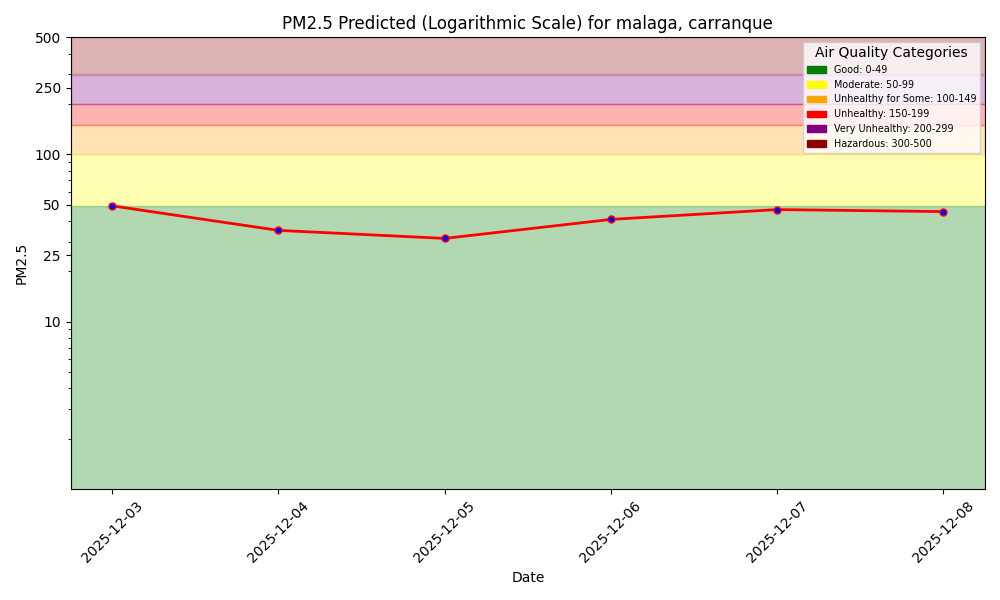
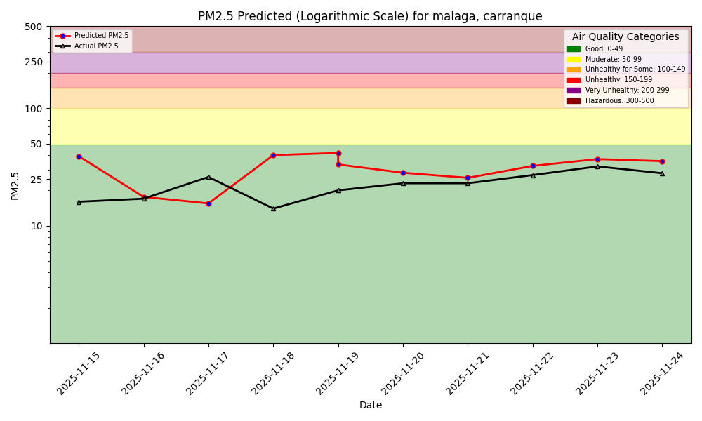
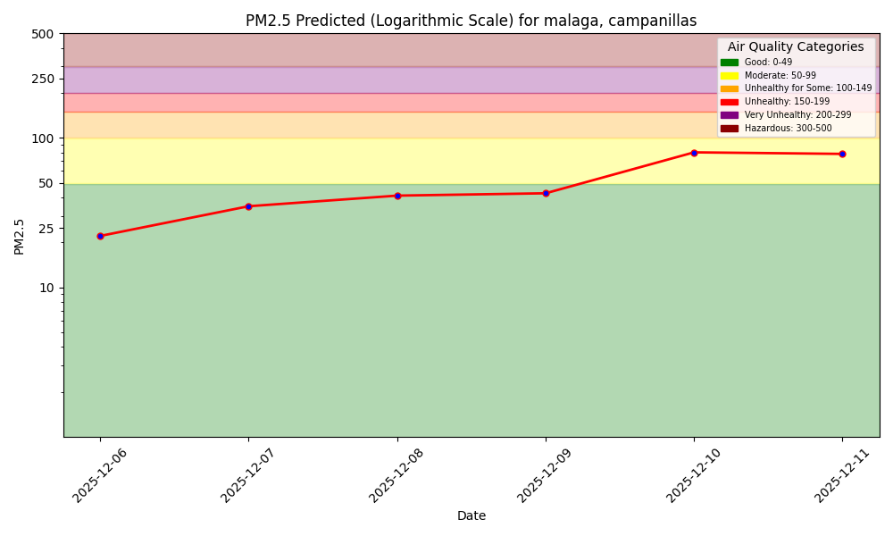
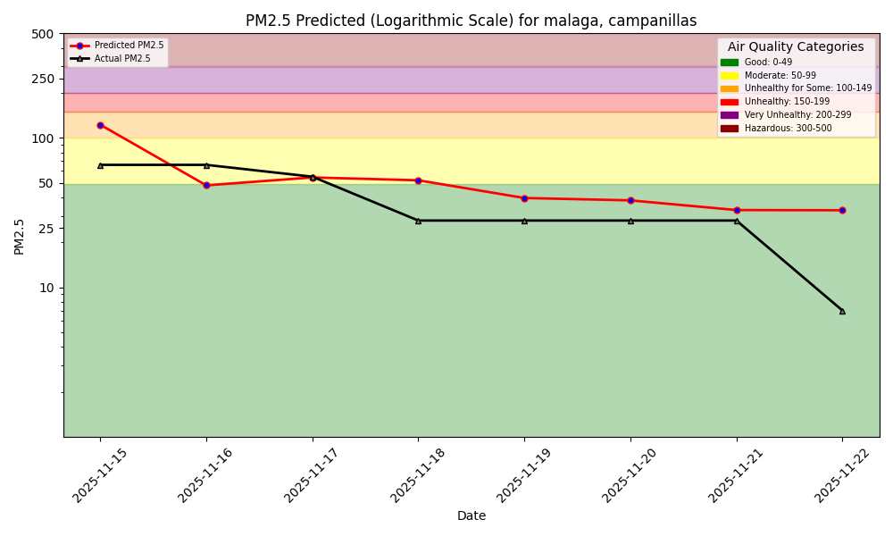
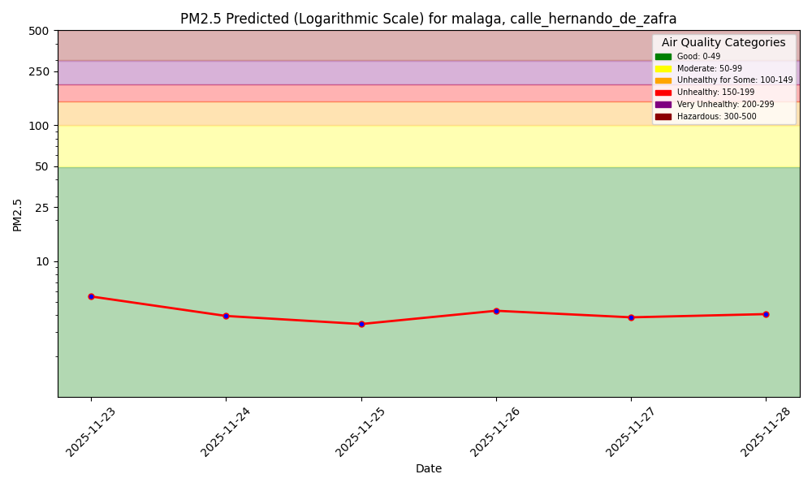
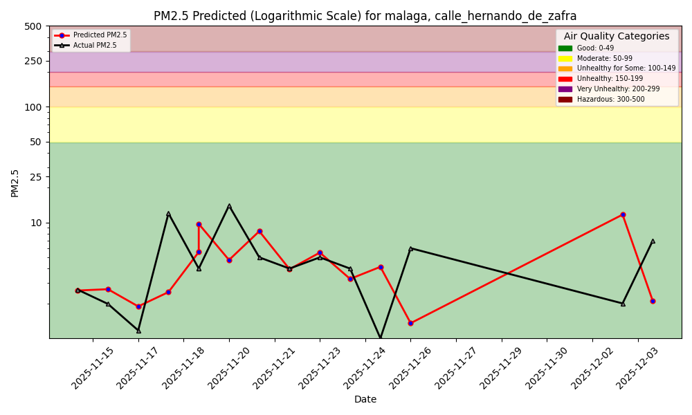
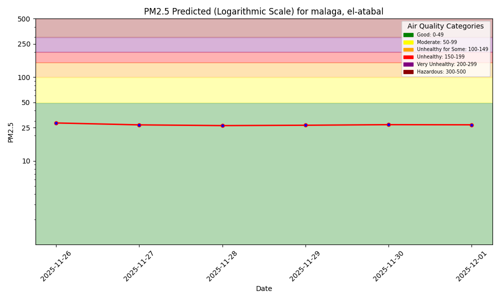
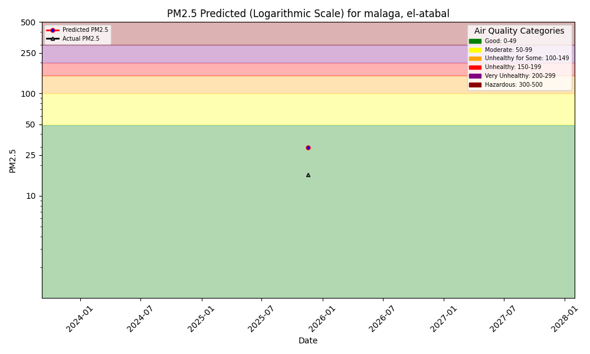

# Air Quality Dashboard – Málaga Sensors

---

## Overview

This dashboard shows:

- **Forecasts** of PM2.5 for the next days (per sensor)
- **1-day hindcast**: yesterday’s prediction vs the actual measured PM2.5

All plots are generated daily by the GitHub Actions pipeline and updated automatically.

---

## Sensor Locations

 

Values shown on the map could be outdated.

## Forecasts & Hindcasts by Location

| Location                    | Forecast (next days)                                                                                     | 1-Day Hindcast (predictions vs outcomes)                                                |
|-----------------------------|----------------------------------------------------------------------------------------------------------|-----------------------------------------------------------------------------------------|
| **Carranque**               |                                       |  |
| **Campanillas**             |                          |   |
| **Calle Hernando de Zafra** |  |  |
| **El Atabal**               |                              |       |
---

